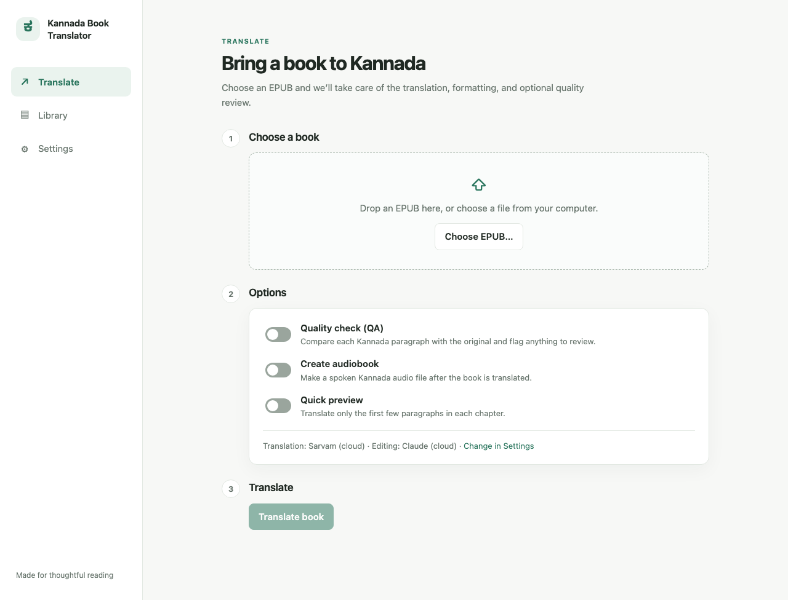
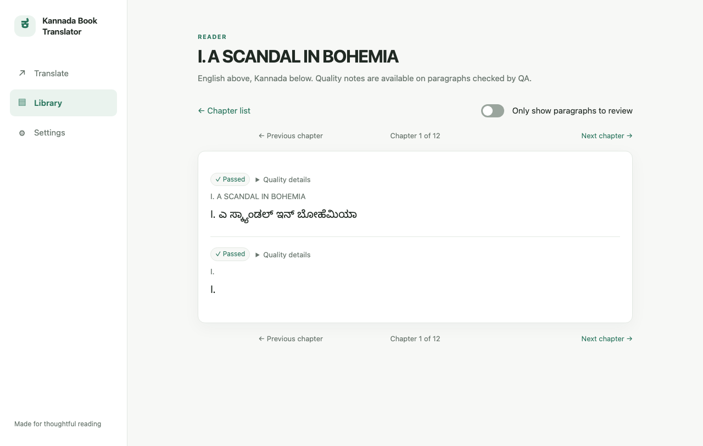
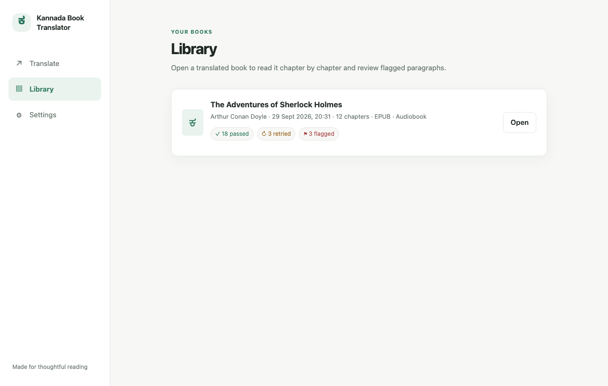

# Indic Book Translator

Translates English EPUB books into Kannada; more Indic languages are planned.

> **Status:** This is an early v0.1 release. Translations are unreviewed machine
> translation: they may be useful for reading drafts, but are not a substitute
> for a human translator. A planned human quality audit of the output has not
> been done yet. The optional built-in QA check flags likely problems; it does
> not guarantee accuracy.

## What it does

- Turns an English EPUB into a Kannada EPUB while keeping its layout, links, and
  images, and embedding a Kannada font.
- Translates table cells one at a time while retaining their table structure.
- Offers an optional back-translation quality check and an optional Kannada
  audiobook.
- Runs with cloud providers or, when the local models are installed, on your
  computer.

## Screenshots







## Quick start: the app

The app runs a local web interface in your browser. Its default providers are
cloud services; the command-line pipeline defaults to local models.

**1. Install** (once, from the repository folder):

```bash
python3 -m venv .venv
.venv/bin/pip install -e ".[gui]"
# Optional: add local translation, speech, and QA models:
.venv/bin/pip install -e ".[gui,local]"
```

The `gui` extra installs the app; `local` adds the optional local model
libraries. On Windows use `.venv\Scripts\pip` and `.venv\Scripts\python`
instead of `.venv/bin/...`.

**2. Start the app:**

```bash
.venv/bin/python -m kannada_epub.app
```

Your browser opens to the app. Keep the terminal open while using it; press
Ctrl+C there to quit. Use `--no-browser` to start without opening a tab. Use
`--port 7861` to choose another port.

**3. Choose providers in Settings.** The defaults are Sarvam `sarvam-m` for
translation, Claude `claude-haiku-4-5` for editing, and Sarvam Bulbul `bulbul:v3`
for narration. Add the required keys in **Settings → API keys**, or choose
local providers (which need the `local` extra and downloaded model files).
Saved keys are stored in your user data folder and are not shown again.

**4. Translate a book.** On **Translate**, choose an EPUB, optionally enable
**Quality check (QA)** or **Create audiobook**, and press **Translate book**.
**Quick preview** limits the first run to a small number of paragraphs per
chapter (two by default). When it finishes, use **Open in Books app**, **Show in
folder**, or the download links.

**5. Read and review.** **Library** lists completed books. Open a book and
chapter to see each English paragraph above its Kannada translation. **Only
show paragraphs to review** filters to paragraphs marked for retry or review
when QA is enabled.

The uploaded EPUBs and outputs are in
`Documents/KannadaBookTranslator/books/` and
`Documents/KannadaBookTranslator/outputs/`. Settings, API keys, and the glossary
are kept in the operating system's app-data folder. Set `KANNADA_DOCUMENTS_DIR`
to change the books/output location, or `KANNADA_APP_DATA_DIR` to change the
private app-data location.

## Known limitations

- Bold, italic, and links inside a translated paragraph are dropped (as is other
  inline markup). The paragraph, its IDs, and the rest of the EPUB are kept;
  ID-bearing descendants such as navigation anchors are retained empty.
- Headings and proper nouns are sometimes transliterated rather than
  translated. For example, “A Scandal in Bohemia” came out as a sound-alike.
- Local Parler-TTS narration is slow: about 21 minutes for 24 paragraphs on an
  Apple Silicon Mac. Cloud narration ignores emotion tags.
- Kannada is the only target language so far.
- There are no packaged desktop installers yet; run the app from source.

## More detail

### Prerequisites and command-line use

Python 3.11 or later is required. The app can use cloud services without local
ML models. Local IndicTrans2, Parler-TTS, and MiniLM models require additional
libraries and model files; the models can take several gigabytes of disk space.

The command-line pipeline reads configuration files and defaults to local
providers. From a fresh checkout:

```bash
pip install -e ".[local]"
cp config/book.example.yaml config/book.yaml
cp config/consistency_editor.example.yaml config/consistency_editor.yaml
cp .env.example .env  # only needed for cloud providers
python scripts/setup.py
python scripts/translate_book.py --limit-chapters item4 --max-paragraphs 2 --batch-size 2
```

After configuring and testing a short run, translate the full book with:

```bash
python scripts/translate_book.py
```

The app and command line use the same in-process pipeline. The setup checker
validates the Python version, dependencies, book and provider configuration,
EPUB path, selected model files, and provider credentials or local services.

To translate your own EPUB, set `book.epub_path`, `book.output_dir`, and
`book.glossary_db` in `config/book.yaml`, then run `python scripts/setup.py`
followed by `python scripts/translate_book.py`.

Run `python scripts/translate_book.py --help` for available options, including
`--config`, `--epub`, `--output-dir`, `--limit-chapters`, `--max-paragraphs`,
`--batch-size`, `--no-epub`, and `--audiobook`. To rebuild an EPUB from existing
translation output, use `python scripts/build_epub.py --help` for its options.

### Providers and QA

The app's default cloud providers are Sarvam for translation and TTS, and Claude
for editing. Its Settings page also supports other OpenAI-compatible providers,
Ollama editing, and local IndicTrans2 or Parler-TTS providers. The command-line
configuration can select local or cloud providers independently for each
stage. Cloud services receive the text needed for the stages configured to use
them; local providers process that stage on your computer.

QA is optional and off by default. It back-translates Kannada into English,
then compares embeddings of the original and back-translated text. By default,
scores of at least 0.85 pass; scores from 0.70 up to 0.85 trigger one
re-translation attempt; lower scores are flagged for review. A retry is kept
only when its score improves. These scores are a screening aid, not a measure
that guarantees correctness. The app can use the editing model for
back-translation and hosted embeddings, or local IndicTrans2 and MiniLM models.

For command-line runs, QA can be enabled in `config/book.yaml`:

```yaml
qa:
  enabled: true
  back_translation: indictrans2_local  # or llm
  embedding: local_minilm              # or openai_compatible
  embedding_model: sentence-transformers/all-MiniLM-L6-v2
```

Download local QA models with `python scripts/download_qa_models.py` if using
the local back-translation path. Settings → Local mode in the app lists local
libraries and model setup commands.

### Outputs and resuming

The output folder contains the translated `.kn.epub`, a `qa_report.json` when QA
is enabled, a `.kn.wav` audiobook when requested, per-chapter JSON files,
checkpoints, and a chapter manifest. Completed batches are checkpointed so an
interrupted run can resume. With a chapter/paragraph-limited trial run, only
translated paragraphs change; unprocessed content remains as it was in the
source EPUB.

The EPUB writer edits the source archive directly: untouched entries are
copied byte-for-byte; `mimetype` remains first and uncompressed; and the writer
adds Noto Sans Kannada regular/bold fonts, the font license, and Kannada CSS.
Translations are inserted by stable paragraph indices. EPUBCheck 5 can be used
for separate validation; it is not integrated into the app.

Tables are translated cell by cell. Table structure and attributes are retained
by replacing the text in the source cells; CSS rules in the output help fit
Kannada text. Headings may be included among translated blocks, depending on
the EPUB structure.

### Glossary and local models

The SQLite glossary stores candidate character names, acronyms, and terms for
human review. Export candidates to CSV, fill in approved Kannada terms, and
import the reviewed CSV:

```python
from kannada_epub.epub_io import load_epub_chapters
from kannada_epub.glossary import (
    GlossaryStore, extract_candidates,
    export_pending_for_review, import_reviewed,
)

store = GlossaryStore("data/project.glossary.db")
for chapter in load_epub_chapters("data/my_book.epub"):
    store.add_candidates(extract_candidates(chapter.text, chapter.id))
export_pending_for_review(store, "glossary_review.csv")
# Fill target_term and approved/rejected in the CSV, then:
import_reviewed(store, "glossary_review.csv")
```

Only approved entries with a Kannada `target_term` are used. The local
translation provider uses IndicTrans2; local speech uses Indic Parler-TTS. The
local speech model is gated and requires Hugging Face access. Run
`python scripts/download_tts_model.py` when choosing local narration.

### Troubleshooting

- **A local provider is selected but libraries are missing:** choose a cloud
  provider in Settings or install `.[gui,local]` and restart the app.
- **An API key is missing:** add it in Settings → API keys, or set the
  corresponding environment variable before starting the app.
- **The app page did not open:** visit `http://127.0.0.1:7860` while the
  terminal is running. If the port is busy, use
  `python -m kannada_epub.app --port 7861`.
- **QA reports an embedding-model error:** select a model matching the
  configured embedding provider. Local MiniLM uses
  `sentence-transformers/all-MiniLM-L6-v2`.
- **Unexpected content near the start/end of the book:** Gutenberg boilerplate
  paragraphs are skipped automatically. Non-linear documents are also skipped;
  configure `exclude_ids` for additional spine IDs.
- **Paragraph-count mismatch:** the pipeline stops rather than placing
  translation under the wrong source paragraph. Retry the chapter; reduce
  `batch_size` if it keeps happening.

## Repo layout

```text
src/kannada_epub/app/server.py   local web server and API
src/kannada_epub/app/static/     offline app UI assets
src/kannada_epub/pipeline.py     in-process translation, QA, EPUB, and audio run
src/kannada_epub/                EPUB, translation, glossary, QA, and TTS library
scripts/                         command-line tools and plain-script tests
config/*.example.yaml            versioned configuration templates
assets/fonts/                    Noto Sans Kannada fonts and OFL.txt
docs/                            screenshots and project documentation
data/sherlock_holmes.epub        public-domain sample book
AGENTS.md                        repository invariants and agent guidance
CONTRIBUTING.md                  development and pull request guide
SECURITY.md                      security reporting and security model
CHANGELOG.md                     release history
epub_kannada_translation_prd.md  requirements and implementation status
```

## Using translations responsibly

- **Which books.** Translate books you own for your own reading, or books in
  the public domain. Don't share or sell a translation (or audiobook) of a
  copyrighted book without the rights holder's permission.
- **Public domain varies by country.** A book can be free in one country and
  copyrighted in another. For a book first written in another language, the
  English translation has its own copyright too.
- **Project Gutenberg books.** Gutenberg's header and licence are never
  translated. Before sharing a translated Gutenberg book, turn on **Remove
  Project Gutenberg text from the output** in Settings → Advanced. Check the
  cover image yourself; the run log lists any Gutenberg mentions left.
- **DRM.** Only DRM-free EPUBs can be opened; the tool does not remove DRM.
- **Accuracy.** Output is unreviewed machine translation and can be wrong.
  Each output EPUB is labelled as machine translation; keep that label when
  you share it.
- **Your data.** With a cloud provider, the book's text is sent to that
  provider under its terms, using your own API key. Local providers keep
  everything on your computer.

## Contributing

See [CONTRIBUTING.md](CONTRIBUTING.md) for development setup, tests, and pull
request guidance. Report security issues privately as described in
[SECURITY.md](SECURITY.md). The [changelog](CHANGELOG.md) tracks releases.

## License

The code is MIT licensed; see [LICENSE](LICENSE). Noto Sans Kannada is
distributed under the SIL Open Font License in
[`assets/fonts/OFL.txt`](assets/fonts/OFL.txt). The sample book is a
public-domain Project Gutenberg EPUB, with Project Gutenberg's license text
included in the file.
